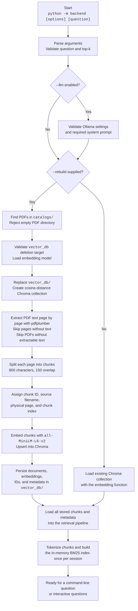
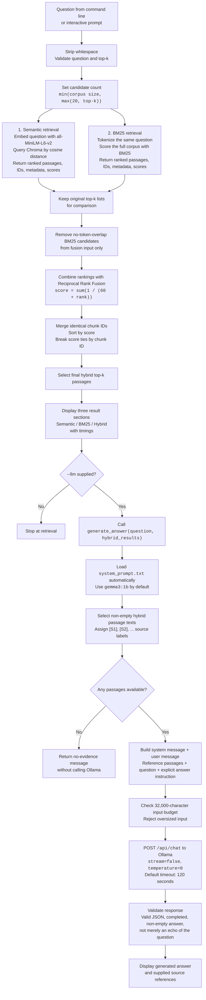

# Construction Catalog Search

A local backend that returns semantic (RAG retrieval), BM25 keyword, and hybrid
rank-fusion results for the same question. It searches PDF catalog passages and optionally generates grounded answers through
a local Ollama model. Local use does not require an API key.

## End-to-end flow

The application has three stages: prepare the catalog index, retrieve passages,
and optionally generate an answer. Evaluation runs through a separate command.
The diagrams below describe the implemented steps. There is currently no separate
learned reranker after rank fusion.

### 1. Prepare or load the index



New or changed PDFs require `--rebuild`. Normal runs do not scan for PDF changes.
Missing indexes, empty corpora, and invalid inputs produce errors. Scanned PDFs
need OCR before indexing. A rebuild replaces the index in place, so extraction or
indexing failure can leave an incomplete index.

### 2. Retrieve, combine rankings, and optionally answer



The retrieval branches are independent searches, executed **semantic first, then
BM25**, not in parallel. Only hybrid passages go to the LLM. The original semantic
and BM25 lists remain visible for comparison. Hybrid latency includes both searches
and fusion; LLM generation is a separate step.

For a single question the program then exits. In interactive mode it returns to
the query prompt and reuses the BM25 index. Enter `exit`, `quit`, or an empty line
to finish; EOF and Ctrl+C at the input prompt also end the session. Each LLM request
is independent, with no previous conversation history. Generation failures leave
retrieval output visible; interactive mode reports the error and accepts another
question. Citation correctness is not automatically checked.

### 3. Separate evaluation flow

```mermaid
flowchart TD
    A["<code>python -m backend.evaluation [options]</code>"] --> B["Parse method, top-k, dataset,<br/>output directory, and warm-up options"]
    B --> C["Load and validate labelled dataset<br/>Reject an existing output directory"]
    C --> D["Open saved Chroma index<br/>Validate corpus is non-empty"]
    D --> E["Verify each question has a matching<br/>labelled source/page in the index"]
    E --> F["Initialize selected retriever(s)<br/>Load embeddings only if needed"]
    F --> G["Record corpus fingerprint<br/>and setup time"]

    G --> H{"--warmup?"}
    H -- Yes --> I["Run first question once<br/>without measuring evaluation metrics"]
    H -- No --> J["Begin evaluation"]
    I --> J

    J --> K["For each dataset question<br/>retrieve using selected method(s)"]
    K --> L["Compare ranked sources/pages<br/>against relevance labels"]
    L --> M["Compute Hit@K, reciprocal rank,<br/>latency, returned count, and failure status"]
    M --> N["Aggregate separately by method,<br/>query type, and difficulty"]
    N --> O["Record dataset/corpus hashes, versions,<br/>model, fusion settings, and timing scope"]
    O --> P["Create a new report directory"]
    P --> Q["Write:<br/><code>results.csv</code><br/><code>failure_cases.csv</code><br/><code>rankings.json</code><br/><code>summary.json</code>"]
    Q --> R["Print metric summaries<br/>and report location"]
    R --> S["Exit"]
```



The default evaluates semantic, BM25, and hybrid. Evaluation does not invoke
Ollama or measure answer correctness. Automated software tests are a different
workflow; see [How to run tests](#how-to-run-tests).

## Project structure

```text
Construction-RAG-bot/
|-- backend/
|   |-- __main__.py             # python -m backend
|   |-- cli.py                  # Search command arguments
|   |-- console.py              # Interactive questions and result display
|   |-- bm25_cli.py             # Optional BM25-only search command
|   |-- llm/
|   |   |-- ollama.py           # Single answer-generation entry point
|   |   `-- system_prompt.txt   # Editable assistant role and instructions
|   |-- retrieval/
|   |   |-- pipeline.py         # Semantic first, then BM25
|   |   |-- fusion.py           # Reciprocal Rank Fusion
|   |   |-- semantic.py         # Chroma cosine retrieval
|   |   `-- bm25.py             # Keyword retrieval
|   |-- storage/
|   |   `-- vector_store.py     # PDF extraction, chunking, index lifecycle
|   `-- evaluation/
|       |-- __main__.py         # python -m backend.evaluation
|       |-- cli.py              # Evaluation command and model loading
|       |-- dataset.py          # Dataset and corpus validation
|       |-- metrics.py          # Pure relevance and ranking metrics
|       |-- runner.py           # Database-independent evaluation
|       |-- reports.py          # CSV/JSON serialization
|       |-- evaluation_dataset.json
|       `-- results/            # Historical reports and new run directories
|-- tests/                     # Regression tests
|-- requirements/
|   |-- base.txt               # Direct dependencies
|   `-- pinned.txt             # Tested direct dependency versions
|-- docs/
|   `-- short_commands.md
|-- catalogs/                  # Input PDFs
|-- vector_db/                 # Generated local Chroma index
|-- .github/workflows/tests.yml
`-- README.md
```

Python package directories also contain `__init__.py`. The backend is a CLI
application; there is no HTTP server. Catalog and index paths resolve relative to
the project root. Existing PDFs and the saved index are reused after this move.

## How to run the application

Run all commands from the project root.

### 1. Install Python dependencies

Use Python 3.10 or newer. From the project root on Windows:

```powershell
py -m venv venv
venv\Scripts\Activate.ps1
python -m pip install -r requirements/pinned.txt
```

On macOS/Linux use `python3 -m venv venv` and `source venv/bin/activate`.
The pinned file records tested direct dependencies; transitive dependencies are
not locked. `requirements/base.txt` provides the unpinned dependency list.
The embedding model (`all-MiniLM-L6-v2`) needs internet access on first download.

### 2. Add PDFs and build the index

Place text-based PDFs in `catalogs/`. Image-only PDFs require OCR first.
On first use, or after changing catalogs, rebuild the index:

```powershell
python -m backend --rebuild
```

Rebuild replaces the existing `vector_db/` in place. Keep a backup if it cannot
readily be regenerated. Normal search and evaluation reuse the index.

### 3. Run retrieval only

```powershell
python -m backend "Which insulation is fire resistant?"
python -m backend --top-k 3 "Which waterproofing system suits a flat roof?"
python -m backend
python -m backend.bm25_cli "waterproofing"
```

Without a question, interactive mode starts. Enter `exit`, `quit`, or an empty
line to finish. Each question runs semantic retrieval first and BM25 second,
independently over the same full corpus. BM25 is indexed once per session.

Each method returns five passages by default, capped by the available chunk
count. Results include rank, source, page, chunk, score, a text preview, and
retrieval time. Semantic similarity and BM25 scores use different scales and
cannot be directly compared numerically. BM25 can return zero-score passages
when query terms are absent. The first semantic query may include model warm-up.

### 4. Run retrieval plus an Ollama answer

Install [Ollama](https://docs.ollama.com/quickstart), then prepare the default model:

```powershell
ollama pull gemma3:1b
ollama list
```

If the Ollama server is not running, run `ollama serve` in another terminal.
Then ask a question or start an interactive session:

```powershell
python -m backend --llm "What is the primary use of the LiquiTEC Roof System?"
python -m backend --llm
```

No model or prompt argument is needed. The application automatically uses
`gemma3:1b` and `backend/llm/system_prompt.txt`. Edit that file to change the system
instructions. Omit `--llm` to stop at retrieval. Configuration and error handling
are explained in [Optional Ollama answer generation](#optional-ollama-answer-generation).

## How to run evaluation

Evaluation runs separately from interactive search:

```powershell
python -m backend.evaluation
python -m backend.evaluation --method hybrid
python -m backend.evaluation --method rag
python -m backend.evaluation --method bm25
python -m backend.evaluation --top-k 10 --warmup
python -m backend.evaluation --dataset backend/evaluation/evaluation_dataset.json --output-dir backend/evaluation/results/my-run
```

The default `--method all` evaluates semantic, BM25, and hybrid using the same
pipeline as search. `--method both` keeps the original two-baseline comparison;
`--method hybrid` reports the combined method alone.
BM25-only evaluation does not load the embedding model. Evaluation never rebuilds
or changes catalog data. It validates dataset fields and checks that each question
has a matching labelled source/page in the index before evaluating.

Every run creates a timestamped directory under `backend/evaluation/results/`:

- `summary.json`: overall and grouped metrics, failure counts, dataset/corpus
  hashes, dependency versions, model name, setup time, and warm-up settings.
- `results.csv`: one row per question per method.
- `failure_cases.csv`: questions with no relevant result at the requested depth.
- `rankings.json`: retrieved passages and scores for inspection.

An explicit `--output-dir` must be a new directory. Previous reports are preserved.

A passage is relevant when its source is in `expected_sources` and its page is
in `expected_pages`. An empty page list accepts any page of an expected source.
Pages are physical PDF pages starting at 1; with multiple sources the page list
applies to each source.

Hit@K measures whether at least one relevant passage appears in the first K
results. MRR averages the reciprocal first relevant rank, or zero for no match,
truncated at `--top-k`. Hit@1/3/5 are reported only within the requested depth,
along with Hit at the requested depth. These labels are not exhaustive chunk-level
judgments, so reports do not claim precision or recall. Latency excludes setup and
report writing. `--warmup` runs one unmeasured query before evaluation.

## Python interface

```python
from backend.retrieval.pipeline import RetrievalPipeline
from backend.storage.vector_store import load_collection

pipeline = RetrievalPipeline(load_collection())
result = pipeline.search("Which insulation is fire resistant?", top_k=5)
rag_matches = result["rag"]["matches"]
bm25_matches = result["bm25"]["matches"]
hybrid_matches = result["hybrid"]["matches"]
```

Reuse the pipeline for subsequent questions; recreate it after rebuilding.
Index settings are in `backend/storage/vector_store.py`, and the default result
count is `TOP_K` in `backend/retrieval/semantic.py`.

## How to run tests

Install the Python dependencies first, then run the complete regression suite
from the project root:

```powershell
python -m unittest discover -s tests -v
```

Run only the LLM integration tests (HTTP responses are mocked):

```powershell
python -m unittest discover -s tests -p "test_llm.py" -v
```

Run only fusion tests:

```powershell
python -m unittest discover -s tests -p "test_fusion.py" -v
```

On Windows, if the virtual environment is not activated, replace `python` with
`venv\Scripts\python.exe`. A successful run ends with `OK`; failures include a
traceback. Tests cover retrieval validation, independent rankings, fusion,
evaluation metrics and report writing, required prompts, LLM request construction,
retrieval-only behaviour, and response/error handling. Temporary report files are
created and cleaned up by the tests.

Tests do not require catalog PDFs, a built index, a running Ollama server, or model
downloads. Passing tests verifies software behaviour; evaluate retrieval quality
with the labelled dataset and check real generated answers separately.

CLI help can be checked without running retrieval:

```powershell
python -m backend --help
python -m backend.evaluation --help
```

Tests use deterministic fixtures without downloading models or modifying the
catalog index. The CI workflow runs tests and checks the evaluation entry point.

## Migration from the old layout

The old root scripts have moved. Replace `python main.py` with `python -m backend`
and `python -m evaluation` with `python -m backend.evaluation`. Imports must use
`backend.*`. Evaluation wrapper scripts remain under `backend/evaluation/` for
single-method use, but the module command above is preferred. Run commands from
the project root, not from inside `backend/`.


## Hybrid ranking

Search now prints a third section, **Hybrid / reciprocal rank fusion**. It retrieves
`max(20, top_k)` candidates per method, capped by corpus size, and merges chunks by
Chroma document ID. The original method sections show their own top-k passages.
For each chunk, the fusion score sums `1 / (60 + rank)` across the contributing
lists, with equal weights. Ties are resolved by chunk ID. Each chunk appears once
in the combined output and carries `retrieval_ranks` for inspection.

BM25 candidates with no query-token overlap are excluded from fusion; the original
BM25 results remain available unchanged. Ranks in the filtered keyword list are
used for fusion. This avoids treating arbitrary no-match ties as keyword evidence,
including when the query contains no terms recognized by the tokenizer.

This implements [Reciprocal Rank Fusion (Cormack et al., 2009)](https://doi.org/10.1145/1571941.1572114).
`RRF_K = 60` and `CANDIDATE_K = 20` are in `backend/retrieval/fusion.py`.
They are starting settings, not tuned or proven optimal for this corpus.
Fusion uses ranks rather than mixing incompatible similarity and BM25 scores.

Hybrid latency includes both retrieval calls plus filtering/fusion; `fusion_ms`
is also available in the Python result. In all-method runs, baseline timings
measure the larger candidate depth used for fusion. Single-method baseline runs
and `--method both` retrieve only top-k, so their timings are not directly
comparable to those larger-depth runs. Evaluation records fusion settings in
`summary.json`; `rankings.json` preserves hybrid scores and contributing ranks.

No model downloads or new dependencies are needed for fusion itself. This is rank
fusion, not a learned reranker. Whether it improves relevance must be measured
using the labelled dataset and matching indexed catalogs.


## Optional Ollama answer generation

Retrieval remains the default. Add `--llm` to send the user
question and full hybrid top-k passages to Ollama after displaying retrieval results.

```powershell
# Stop at retrieval
python -m backend "Which insulation is fire resistant?"

# See models installed in Ollama
ollama list

# Uses gemma3:1b by default
python -m backend --llm "Which insulation is fire resistant?"

# Interactive retrieval plus answer generation
python -m backend --llm

# Custom server and timeout
python -m backend --llm --ollama-url http://localhost:11434 --llm-timeout 180 "Your question"
```

Install and run [Ollama](https://docs.ollama.com/quickstart) first. If its server is
not already running, start it with `ollama serve` in another terminal. Install the default
model with `ollama pull gemma3:1b`. The backend does not download models.

Edit `backend/llm/system_prompt.txt` to describe the assistant, its task, the input
it receives, and how it should answer. This file is always loaded automatically; there is no system-prompt command option. The default prompt asks the model to use supplied evidence, acknowledge
missing information, and cite passage labels such as `[S1]`. These are model
instructions; citation correctness and answer faithfulness are not automatically
verified. The console lists the sources supplied to the model for inspection.

All generation parameters meet at one Python entry point:

```python
from backend.llm import OllamaConfig, generate_answer

answer = generate_answer(
    question=result["query"],
    hybrid_results=result["hybrid"]["matches"],
)
print(answer["answer"])
print(answer["sources"])
```

The system prompt is always loaded from `backend/llm/system_prompt.txt`.
The default model is `DEFAULT_MODEL` in `backend/llm/ollama.py` (`gemma3:1b`);
edit that setting to change the CLI model. Python callers can optionally supply
`config=OllamaConfig(...)` for connection and model settings. Each call sends a separate
system message and a user message containing labelled reference passages followed by the question
and an explicit answer instruction. It uses [Ollama's chat API](https://docs.ollama.com/api/chat) with
`stream=false` and temperature 0. No additional Python dependency is required.
Each interactive question is independent; previous questions are not included.

The default request timeout is 120 seconds. Connection, missing-model, malformed
response, echoed-question, and timeout failures produce readable errors. Retrieval results remain
visible if generation fails. Empty evidence returns a no-evidence message without
calling Ollama. Input exceeding `OllamaConfig.max_context_chars` (32,000 characters
by default) is rejected rather than silently truncated. This character guard does
not guarantee the input fits every model's token context window; choose top-k and
model context capacity accordingly.

Evaluation remains retrieval-only. It measures semantic, BM25, and hybrid ranking,
not the factual accuracy of generated answers.
